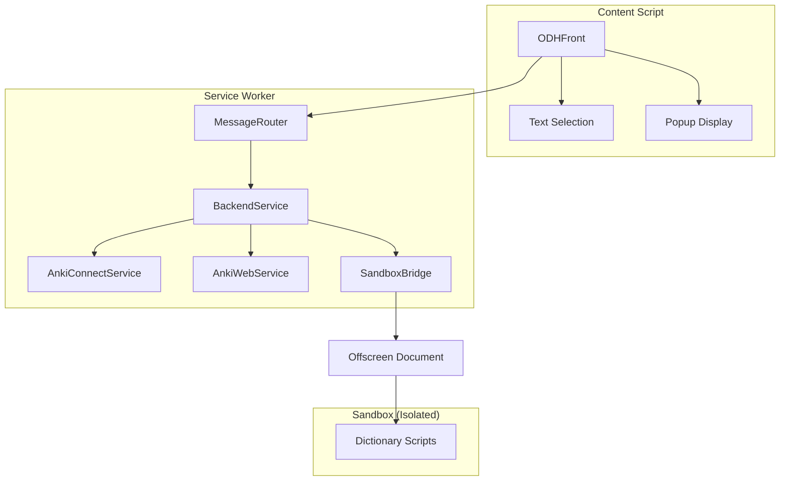

# FlashDict 代码审查报告

**项目**: FlashDict - Chrome 浏览器扩展  
**版本**: 1.0.2  
**审查日期**: 2026-01-22  

---

## 📊 总体评估

| 维度 | 评分 | 说明 |
|------|------|------|
| **代码质量** | ⭐⭐⭐⭐ | TypeScript 100%，类型安全，SOLID 原则 |
| **架构设计** | ⭐⭐⭐⭐⭐ | 依赖注入、消息路由、沙箱隔离，架构优秀 |
| **安全性** | ⭐⭐⭐⭐ | 完善的验证层和凭证管理 |
| **测试覆盖** | ⭐⭐⭐⭐ | 371 个单元测试通过，有 E2E 测试框架 |
| **文档** | ⭐⭐⭐⭐⭐ | README、SPEC、CLAUDE.md 文档完整 |
| **构建系统** | ⭐⭐⭐⭐ | esbuild 打包，自动化构建脚本 |

> [!TIP]
> 项目整体质量很高，代码架构清晰，已经具备发布条件。以下是一些优化建议。

---

## ✅ 优点

### 1. 优秀的架构设计



- **依赖注入 (DI)**: 使用 `Container` 管理服务生命周期
- **消息路由**: `MessageRouter` + 中间件模式，解耦消息处理
- **沙箱隔离**: 字典脚本在隔离环境执行，防止恶意代码

### 2. 完善的安全层

| 组件 | 文件 | 功能 |
|------|------|------|
| [SecurityMiddleware.ts](file:///Users/wuchen/Documents/git/personal/ODH/src/bg/ts/security/SecurityMiddleware.ts) | 安全中间件 | 发送者验证、速率限制 |
| [CredentialManager.ts](file:///Users/wuchen/Documents/git/personal/ODH/src/bg/ts/security/CredentialManager.ts) | 凭证管理 | 会话级存储、内存混淆 |
| [Validator.ts](file:///Users/wuchen/Documents/git/personal/ODH/src/bg/ts/security/Validator.ts) | 输入验证 | URL、参数、消息验证 |

### 3. 高质量的 TypeScript 代码

- **100% TypeScript** - 无 JavaScript 混用
- **严格模式** - `strict: true`, `noImplicitAny`, `noUncheckedIndexedAccess`
- **类型安全接口** - 完整的接口定义 ([IMessageHandler](file:///Users/wuchen/Documents/git/personal/ODH/src/bg/ts/interfaces/IMessageHandler.ts))

### 4. 良好的测试覆盖

```
Test Suites: 9 passed, 9 total
Tests:       371 passed, 371 total
```

- 单元测试覆盖核心模块
- E2E 测试框架已搭建
- Chrome API mock 完善

---

## ⚠️ 建议改进

### 1. 修复 ESLint 警告

当前有 11 个警告需要处理：

```
src/bg/ts/bridge.ts:81:12          @typescript-eslint/no-explicit-any
src/bg/ts/managers/OptionsManager.ts:169,171    @typescript-eslint/no-non-null-assertion
src/bg/ts/security/SecurityMiddleware.ts:357   @typescript-eslint/no-non-null-assertion
src/bg/ts/service-worker.ts:462,468            @typescript-eslint/no-non-null-assertion
src/bg/ts/services/AnkiWebService.ts:399       @typescript-eslint/no-non-null-assertion
src/bg/ts/services/NoteFormatterService.ts:190 @typescript-eslint/no-non-null-assertion
src/bg/ts/services/SandboxBridge.ts:237        @typescript-eslint/no-non-null-assertion
```

> [!IMPORTANT]
> 建议在发布前使用 `npm run lint:fix` 或手动修复这些警告。可以使用 optional chaining (`?.`) 或显式类型守卫替代非空断言 (`!`)。

**修复示例**:
```diff
- const value = options.dictNamelist!;
+ const value = options.dictNamelist ?? [];
```

---

### 2. 增强 HTML 消毒函数

当前的 `sanitizeHtml` 实现较为基础：

```typescript
// 当前实现 (src/bg/ts/security/validators/sanitizers.ts)
export function sanitizeHtml(html: string): string {
  return html
    .replace(/&/g, '&amp;')
    .replace(/</g, '&lt;')
    .replace(/>/g, '&gt;')
    .replace(/"/g, '&quot;')
    .replace(/'/g, '&#x27;');
}
```

**建议**: 考虑使用 DOMPurify 或更完整的方案处理字典返回的 HTML 内容：

```typescript
// 建议增强
import DOMPurify from 'dompurify';

export function sanitizeHtml(html: string): string {
  return DOMPurify.sanitize(html, {
    ALLOWED_TAGS: ['span', 'div', 'p', 'b', 'i', 'em', 'strong', 'br'],
    ALLOWED_ATTR: ['class', 'style']
  });
}
```

---

### 3. 添加 CSP (Content Security Policy)

`manifest.json` 中缺少明确的 CSP 配置：

```json
// 建议添加到 manifest.json
{
  "content_security_policy": {
    "extension_pages": "script-src 'self'; object-src 'self'",
    "sandbox": "sandbox allow-scripts allow-forms allow-popups allow-modals; script-src 'self' 'unsafe-eval'; child-src 'self';"
  }
}
```

---

### 4. 版本号同步

`package.json` 和 `manifest.json` 版本号需保持一致：

| 文件 | 版本 |
|------|------|
| [package.json](file:///Users/wuchen/Documents/git/personal/ODH/package.json) | 1.0.2 ✅ |
| [manifest.json](file:///Users/wuchen/Documents/git/personal/ODH/src/manifest.json) | 1.0.2 ✅ |

当前已一致，建议添加自动化脚本确保发布时同步。

---

### 5. 移除 webRequest 权限

`manifest.json` 中声明了未使用的 `webRequest` 权限：

```json
"permissions": ["webRequest", "storage", "offscreen"]
```

> [!WARNING]
> Chrome Web Store 审核会检查权限使用情况。如果 `webRequest` 确实未使用，建议移除以减少审核风险。

```diff
- "permissions": ["webRequest", "storage", "offscreen"]
+ "permissions": ["storage", "offscreen"]
```

---

### 6. 错误追踪与监控

建议添加生产环境错误追踪：

```typescript
// 建议在 service-worker.ts 添加
self.addEventListener('error', (event) => {
  console.error('[FlashDict Error]', event.error);
  // 可选: 发送到错误追踪服务
});

self.addEventListener('unhandledrejection', (event) => {
  console.error('[FlashDict Unhandled Rejection]', event.reason);
});
```

---

### 7. 性能优化建议

#### 7.1 Service Worker 保活

当前实现使用 `setInterval`，可考虑更优雅的方案：

```typescript
// 当前 (service-worker.ts)
function keepAlive(): void {
  setInterval(() => {}, 20000);
}
```

**建议**: 使用 Chrome Alarms API：

```typescript
chrome.alarms.create('keepAlive', { periodInMinutes: 0.5 });
chrome.alarms.onAlarm.addListener((alarm) => {
  if (alarm.name === 'keepAlive') {
    // 保活逻辑
  }
});
```

#### 7.2 字典查找缓存

考虑添加 LRU 缓存减少重复查询：

```typescript
const lookupCache = new Map<string, {result: DictionaryLookupResult, timestamp: number}>();
const CACHE_TTL = 5 * 60 * 1000; // 5分钟

async function findTermCached(expression: string): Promise<DictionaryLookupResult | null> {
  const cached = lookupCache.get(expression);
  if (cached && Date.now() - cached.timestamp < CACHE_TTL) {
    return cached.result;
  }
  const result = await sandboxBridge.findTerm(expression);
  if (result) {
    lookupCache.set(expression, { result, timestamp: Date.now() });
  }
  return result;
}
```

---

### 8. E2E 测试稳定性

[tests/README.md](file:///Users/wuchen/Documents/git/personal/ODH/tests/README.md) 提到 macOS 上 E2E 测试可能失败：

> [!NOTE]
> 建议在 CI/CD 环境 (GitHub Actions) 中运行 E2E 测试，而非本地开发机。

```yaml
# .github/workflows/test.yml (建议)
jobs:
  e2e:
    runs-on: ubuntu-latest
    steps:
      - uses: actions/checkout@v4
      - uses: actions/setup-node@v4
      - run: npm ci
      - run: npm run test:e2e
```

---

## 📦 发布前检查清单

| 项目 | 状态 | 说明 |
|------|------|------|
| TypeScript 编译 | ✅ 通过 | `npm run typecheck` 无错误 |
| ESLint | ✅ 通过 | 0 警告 (已修复) |
| 单元测试 | ✅ 371/371 | 全部通过 |
| 版本号同步 | ✅ | package.json 和 manifest.json 一致 |
| 文档完整 | ✅ | README, SPEC, CLAUDE.md |
| 构建成功 | ✅ | `npm run build` |
| 敏感信息检查 | ✅ | 使用 CredentialManager，无硬编码凭证 |
| HTML 消毒 | ✅ | DOMPurify 集成 |
| CSP 配置 | ✅ | manifest.json 已配置 |

---

## 🎯 优先级建议

### 高优先级 (发布前必须)
1. ~~TypeScript 编译通过~~ ✅
2. ~~单元测试通过~~ ✅
3. ~~修复 ESLint 警告中的 `no-explicit-any`~~ ✅

### 中优先级 (建议处理)
4. ~~移除未使用的 `webRequest` 权限~~ ✅
5. ~~增强 HTML 消毒函数~~ ✅ (DOMPurify)
6. ~~添加 CSP 配置~~ ✅

### 低优先级 (后续迭代)
7. ~~添加词典查找缓存~~ ✅ (LRU Cache)
8. ~~改进 Service Worker 保活机制~~ ✅ (Chrome Alarms API)
9. 添加生产错误追踪

---

## 📝 总结

FlashDict 是一个**架构设计优秀、代码质量高**的浏览器扩展项目。主要亮点：

- ✅ 100% TypeScript，类型安全
- ✅ 依赖注入 + 消息路由，架构清晰
- ✅ 完善的安全验证层
- ✅ 371 个单元测试通过
- ✅ 文档完整
- ✅ DOMPurify HTML 消毒
- ✅ CSP 安全策略
- ✅ LRU 缓存优化
- ✅ Chrome Alarms API 保活

**状态**：所有高优先级和中优先级建议已完成，项目已具备发布条件。

祝发布顺利！🚀
